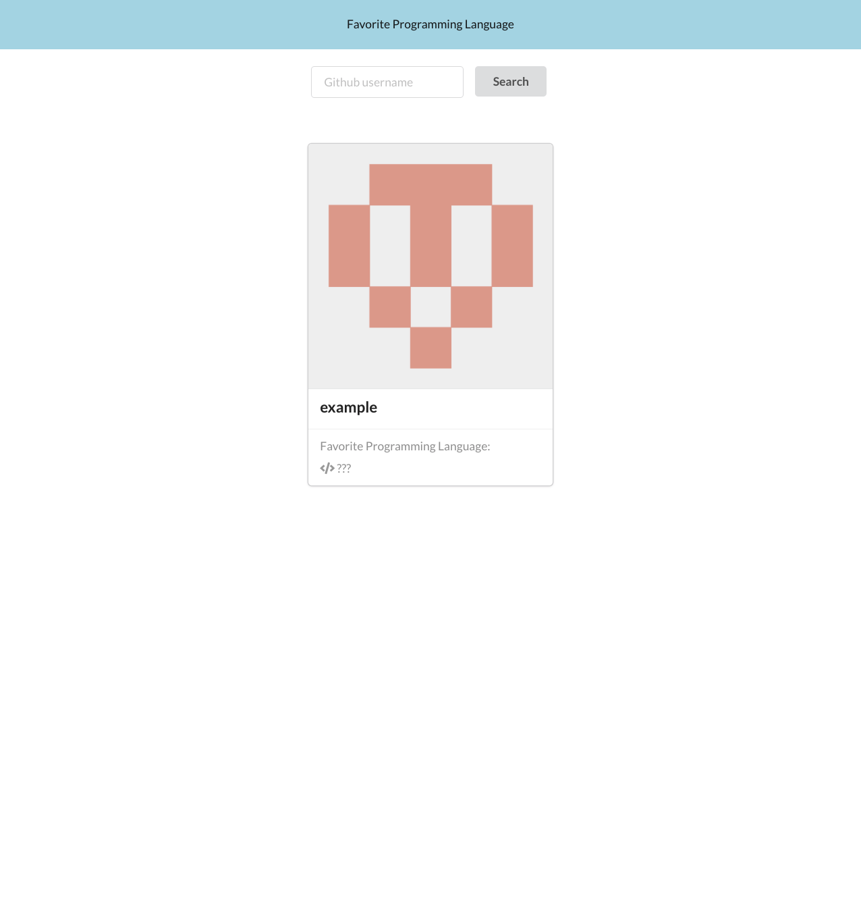

# Favorite Language

## find out a Github users favorite programming language

Favorite-Language is a simple React app that allows users to enter an arbitrary Github username, and be presented with a best guess of the Github user's favourite programming language

## Tech

Favorite-Language was built using the following:

- [create-react-app] - HTML enhanced for web apps!
- [Node.js] - JavaScript runtime built on Chrome's V8 JavaScript engine.
- [npm] - Node package manager.

## Installation

1. Clone or fork this repo.
2. If you do not already have Node, install it from thier homepage.
3. From the project root directory run:

```sh
npm install
```

4. Authorise the app using the guide bellow.
5. Start the server using:

```sh
npm start
```

[npm]: https://www.npmjs.com/
[node.js]: https://nodejs.org/en/
[node.js]: http://nodejs.org
[create-react-app]: https://reactjs.org/docs/create-a-new-react-app.html

## Authorisation

In order to access more data requests with the Github API you will need to authorise your app with a personal access token.

1. Log on to Github, click on your avatar and go to Settings.
2. On the left of the page you will need to click on Developer settings
3. Click on Personal access tokens and then Generate new token (you may be asked to enter your password.
4. Check the boxes that pertain to repo and user, then copy the key that was generated for you.
5. In your project root file create a file called .env
6. In .env paste your access token after REACT_APP_API_KEY=
7. Refer to .env sample if you need an example of how this looks.

## How it should look

Here is the landing page...



In the search bar enter a github user same, for example, i'll use mine.


Favorite-Language iterates through all your github repos to provide a total sum of each language used (based on file size)

## Features I would like to add

Current the API calls are quite demanding depending on how prolific the Github user is. Having played around with authentication it seems as though I may need to rethink how the app determines the most popular language without having to iterate through users entire profile.

I've just started using React so I'm keen to learn more about how to test in the front end and add it to the project.

Although it's a small app, it could be worth moving the components to separate files as per react conventions.
